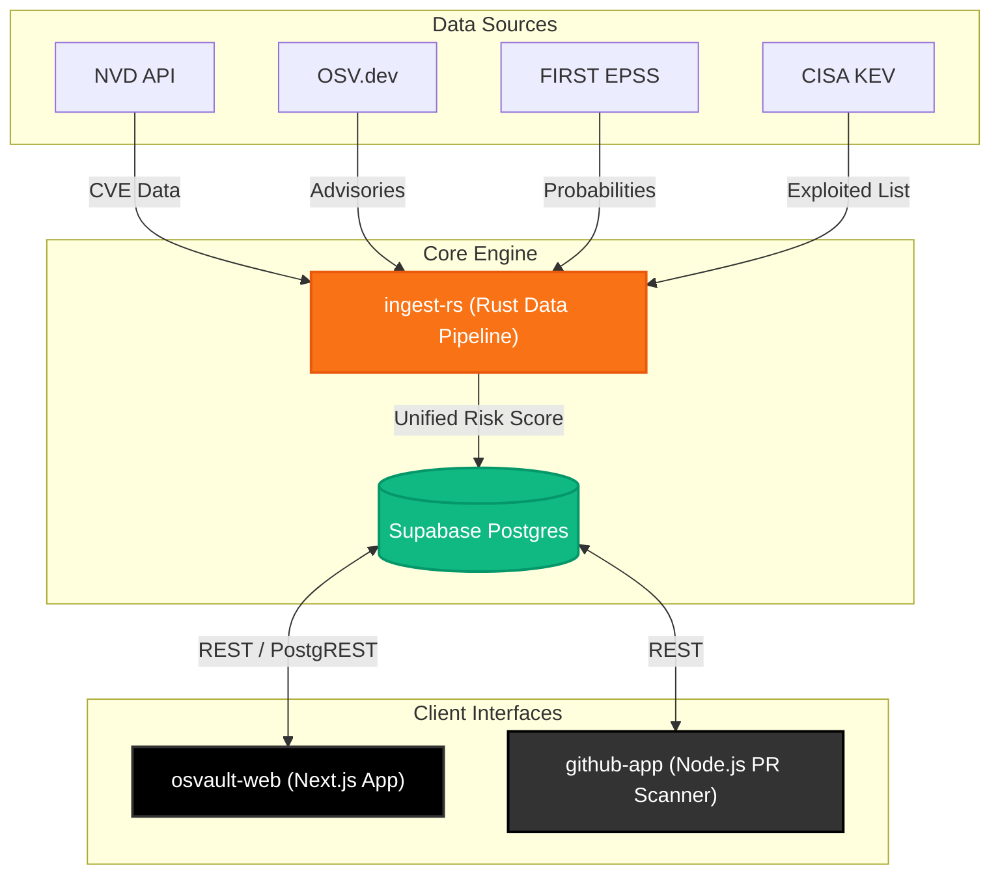

<div align="center">
  
  
  <br>
  
  **The Next-Generation Vulnerability Intelligence Platform for Modern Supply Chains**

  <p>
    <a href="https://github.com/Mursaleen7/OsVault"></a>
    <a href="https://nextjs.org/"></a>
    <a href="https://www.rust-lang.org/"></a>
    <a href="https://supabase.com/"></a>
  </p>
</div>

---

## ⚡ Overview

**OsVault** is a real-time, comprehensive vulnerability intelligence platform specifically tailored for the `npm` and `PyPI` ecosystems. By continuously tracking and aggregating threat intelligence from **NVD**, **OSV.dev**, **FIRST EPSS** (Exploit Prediction Scoring System), and **CISA KEV** (Known Exploited Vulnerabilities), OsVault delivers high-fidelity security insights directly into your workflow.

With components spanning an ultra-fast data orchestrator, an interactive web portal, and a proactive GitHub App, OsVault isn't just an index—it's a complete shift-left security solution built with venture-backed aesthetic standards.

---

## 🚀 Key Features

### 🔍 Interactive CVE Browser & Dependency Scanner
Explore an enriched database of vulnerabilities or run our instantaneous dependency scanner on your `package.json` or `requirements.txt`. Instantly receive a comprehensive security grade alongside an exportable PDF report.

### 🛡️ Automated PR Security Gates (GitHub App)
Stop vulnerable dependencies from reaching production. The **OsVault GitHub App** intercepts PRs, diffs dependency manifests, queries the intelligence graph, and issues native GitHub Check Runs with zero friction.

### ⚙️ High-Performance Ingestion Engine
Written in pure Rust (`ingest-rs`), the background synchronizer effortlessly pulls thousands of records daily. Every vulnerability is autonomously enriched with its exploit likelihood (EPSS) and real-world exploitation status (KEV), then fused into a unified risk metric matrix.

---

## 🏗️ Architecture Matrix

OsVault is built on a resilient, multi-language stack to ensure maximum throughput and sub-second UI latency.



---

## 📂 Repository Structure

| Component | Description | Technologies |
| :--- | :--- | :--- |
| 🌐 [`osvault-web/`](./osvault-web) | The primary user interface. Hosts the CVE browser, package detail views, and real-time dependency scanner. | Next.js 16, React 19, Tailwind CSS, Nuqs |
| 🦀 [`ingest-rs/`](./ingest-rs) | Daily CRON service that syncs vulnerability feeds, normalizes schema, and calculates weighted threat scores. | Rust, Tokio, Reqwest, Serde |
| 🐙 [`github-app/`](./github-app) | Enterprise-grade GitHub integration. Watches PRs, diffs lockfiles, and fails vulnerable builds instantly. | Node.js, Express, Octokit |

---

## 💻 Local Environment Setup

<details>
<summary><b>1. Global Prerequisites</b></summary>
<br/>

Ensure your local development environment has the following installed:
* **Node.js**: v20 or newer
* **Rust**: Stable toolchain (`rustup`)
* **Database**: A Supabase project initialized with the `schema.sql` at the root.

</details>

<details>
<summary><b>2. Next.js Web App</b></summary>
<br/>

Navigate to the frontend directory, provision your environment variables, and start the development server.

```bash
cd osvault-web
cp .env.local.example .env.local   # Configure SUPABASE_URL & SUPABASE_ANON_KEY
npm install
npm run dev
```
</details>

<details>
<summary><b>3. Rust Ingestion Service</b></summary>
<br/>

The ingest orchestrator requires a service-role key for backend DB access.

```bash
cd ingest-rs
cp ../.env.example .env            # Configure SUPABASE_KEY (Service Role) & NVD_API_KEY
cargo run --bin ingest
```
*Tip: Set `CI=true` to limit the CVE pull to the last 24 hours (default locally is 7 days).*
</details>

<details>
<summary><b>4. GitHub Check Run App</b></summary>
<br/>

For instructions on configuring the GitHub App entity, refer to [`github-app/README.md`](github-app/README.md).

```bash
cd github-app
cp .env.example .env
npm install
npm run build
npm start
```
</details>

---

## 🔐 Environment Configuration

OsVault relies on the following environment variables across its distinct modules:

| Variable | Scope | Purpose |
| :--- | :--- | :--- |
| `SUPABASE_URL` | `ingest`, `github-app` | Absolute URL to the Supabase Postgres instance. |
| `SUPABASE_KEY` | `ingest`, `github-app` | Internal service role key (bypass RLS). |
| `NVD_API_KEY` | `ingest` | *(Optional)* Upgrades NVD API limits to 50 req / 30s. |
| `GITHUB_APP_ID` | `github-app` | Numeric identifier for the provisioned GitHub App. |
| `GITHUB_APP_PRIVATE_KEY` | `github-app` | PEM private key for signing validation payloads. |
| `GITHUB_WEBHOOK_SECRET` | `github-app` | Secret token to authenticate incoming webhooks from GitHub. |
| `NEXT_PUBLIC_SUPABASE_URL` | `osvault-web` | Public endpoint for Supabase, exposed to client-side. |
| `NEXT_PUBLIC_SUPABASE_ANON_KEY`| `osvault-web` | Anon/Public key for client-safe REST transactions. |

---

<div align="center">
  <p>Built for the modern secure OSS ecosystem.</p>
</div>
# Testing reachability
# Test webhook
